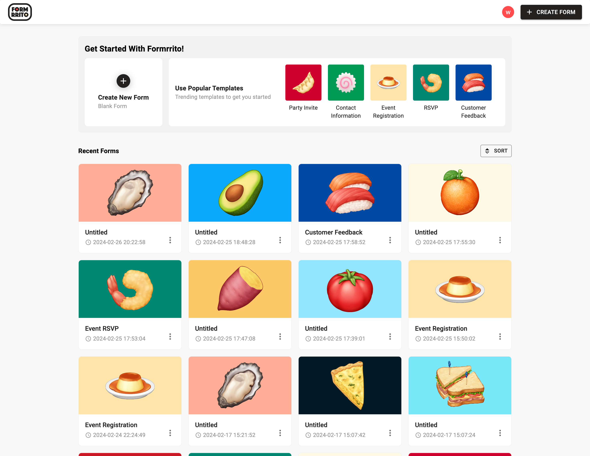
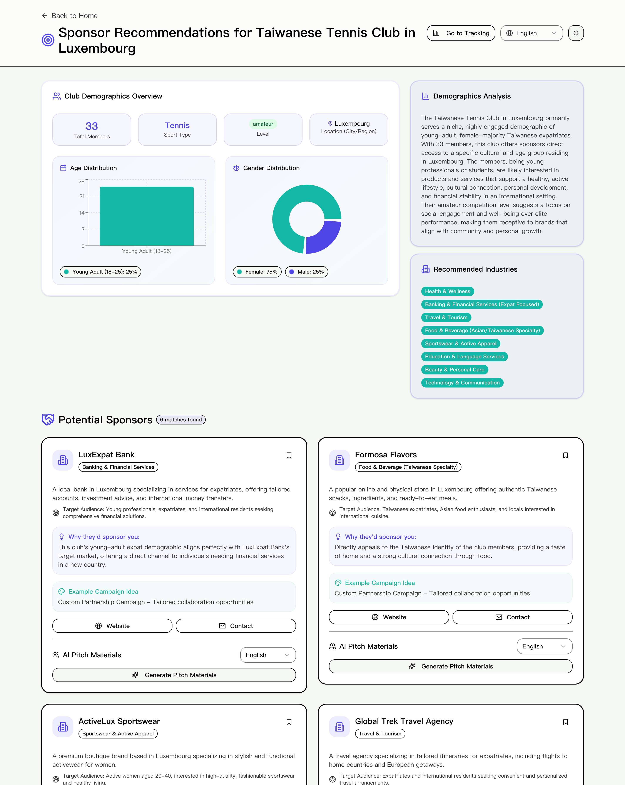
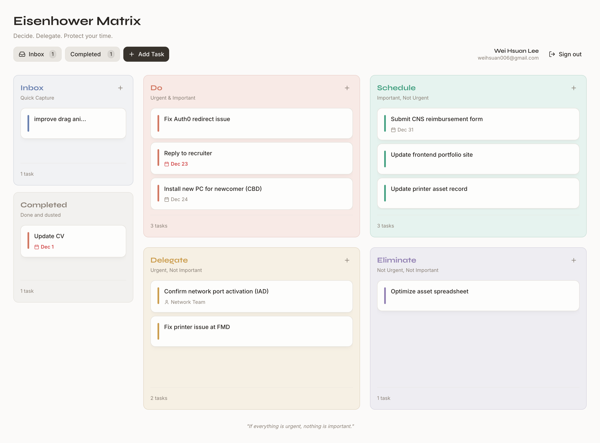

# 👋 Hi, I'm Wei Hsuan Lee (李薇宣)

I'm a **Front-End Developer** from Taipei, Taiwan, about to begin a new chapter in **Luxembourg** as part of the working holiday program.  
With several years of hands-on experience in web development, I’m currently **seeking new job opportunities** in Luxembourg or **remote-friendly teams**.

---

## 💼 Work Highlights

### 🛠️ Front-End Engineer @ [ACCUPASS](https://www.accupass.com/)
- Develop and maintain scalable front-end interfaces using **React, Redux, TypeScript**
- Build and maintain a **cross-project UI library** with Storybook
- Currently working on a **server-side rendered (SSR) website** using the latest **Next.js App Router**
- Create dashboards and data visualizations using **Chart.js**
- Integrate analytics, localization (i18n), and reusable UI patterns across products

---

## 🌯 Side Projects

### 🌯 Formrrito — Flexible Form Builder  
- 🔗 [GitHub Repo](https://github.com/capyba-ramen/formrrito-frontend)

A flexible form-builder platform that lets users “wrap” their questions into custom forms — like a burrito 🌯  
Designed for events, inquiries, and academic use, Formrrito focuses on usability and speed with pre-designed templates and an intuitive creation flow.

**Highlights**
- Built a **dynamic form-building interface** with reusable, configurable components  
- **Collaborated closely with a backend developer** to align API design and frontend data models  
- Took ownership as **PM and designer**, defining user flows, features, and UI decisions 

---

### 🤖 AI Sponsor Finder  
- 🔗 [GitHub Repo](https://github.com/weihsuanlee/v0-ai-sponsor-finder)
- 🌐 Live Link: https://v0-ai-sponsor-finder.vercel.app/
- 📹 Video Demo: https://www.youtube.com/watch?v=yNsAwi7xMCU

An AI-powered tool that helps users **discover potential sponsors** by analyzing context and matching needs efficiently.  
Built as an exploration of **AI-assisted workflows**, modern UI patterns, and rapid prototyping.

**Highlights**
- Designed a **step-based AI agent flow**, guiding users through selectable stages  
- Implemented **AI-assisted workflows** with clear UI states and predictable interactions  
- Built with **Next.js and React**, focusing on fast iteration and UX clarity 

---

### 🌿 Calm Decisions  
- 🔗 [GitHub Repo](https://github.com/weihsuanlee/calm-decisions)
- 🌐 Live Demo: https://v0-eisenhower-matrix-app-khaki.vercel.app/

A minimal web app designed to help users **make decisions calmly and intentionally**, reducing decision fatigue through a clean, distraction-free interface.

**Highlights**
- Created a **lightweight task board** inspired by IT help desk workflows  
- Focused on **minimal UI and reduced cognitive load** for daily use  
- Integrated **AI assistance subtly** to enhance reflection without cluttering the interface 

---

## 🧰 Tech Stack

**Front-End**
- React  
- Next.js  
- TypeScript  
- Redux  
- HTML / CSS  

**UI & Design**
- Storybook  
- Chart.js  
- Figma  
- MJML  

**Tooling**
- Git  

---

📬 **Open to collaborations and job opportunities** — feel free to reach out!
